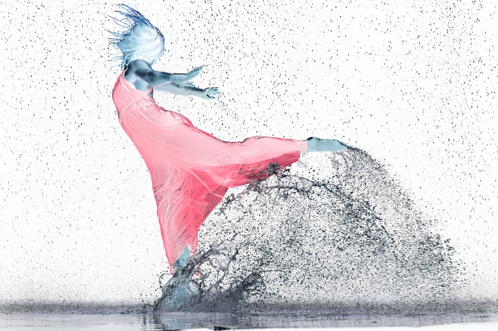

# Processmanto Digital de Imagens - Filtros Básicos 

Este repositório contém o código-fonte produzido no primeiro trabalho da disciplina de Processamento Digital de Imagens. Nele, foram implementados alguns dos filtros de imagem básicos. Neste caso, foram implementados os filtros de negativo, soma, mediana, Sobel e Emboss. Além disso, também foram implementadas funções de conversão para escala de cinza e de conversão do sistema de cores RGB para YIQ, assim como de YIQ para RGB. A linguagem utilizada foi o C++, juntamente com a biblioteca OpenCV. Porém, todos os filtros foram implementados manualmente, sem o uso de funções prontas provenientes da biblioteca OpenCV.

## Imagem Original (Utilizada para testes)

## Negativo em RGB

## Negativo em Y

## Soma 3x3

## Média 7x7

## Escala de Cinza + Sobel

## Escala de Cinza + Sobel com Expansão de Histograma

## Escala de Cinza + Emboss

## Mediana 7x7

